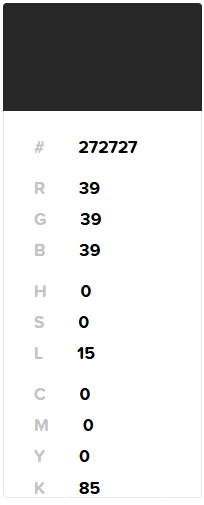
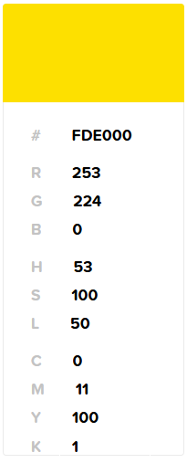
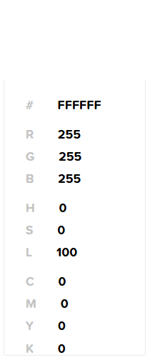
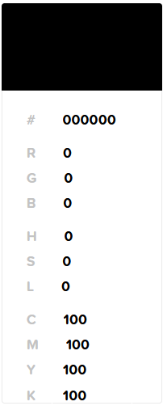

# Cores

<figure><figcaption>
"Optimum Gray"
</figcaption></figure>

<figure><figcaption>
"Optimum Yellow"
</figcaption></figure>

<figure><figcaption>
Branco
</figcaption></figure>

<figure><figcaption>
Preto
</figcaption></figure>
